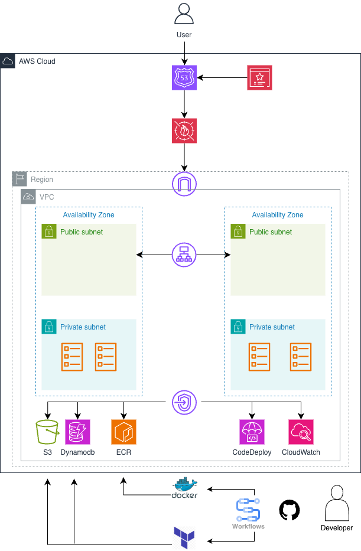

# URL Shortener on AWS (ECS Fargate)


---
## Description

This service accepts a long URL, generates a short code and redirects requests for the short URL back to the original destination.

The application runs as a containerised Python service on **ECS Fargate**, behind an **Application Load Balancer (ALB)** protected by **AWS WAF**.  

URL mappings are stored in **DynamoDB**, and deployments are handled via **AWS CodeDeploy** using **blue/green canary releases**.

All infrastructure is managed using **Terraform** and CI/CD is implemented with **GitHub Actions** using **OIDC** (no long-lived AWS credentials).

---

## Architecture


---
## Repository Structure

```text
.
├── .github/
│   └── workflows/
│       ├── build.yaml
│       └── deploy.yaml
│
├── app/
│   ├── src/
│   ├── tests/
│   ├── Dockerfile
│   └── requirements.txt
│
├── images/
│
└── infra/
    ├── envs/
    │   └── dev/
    │
    ├── global/
    │   └── backend/
    │
    └── modules/
│    
├── modules/                 
├── README.md
└── .gitignore
```

## Features

- Containerised URL shortener application using Docker.
- Deployed on AWS ECS Fargate (serverless containers).
- Blue/Green deployments with AWS CodeDeploy.
- Application Load Balancer with health checks.
- Zero-downtime deployments.
- Infrastructure as Code using Terraform.
- Secure CI/CD using GitHub Actions with AWS OIDC (no static credentials).
- Environment isolation using Terraform modules.
- Automated image build and push to Amazon ECR.
- Automated ECS task definition revisions.
- Canary deployment strategy using CodeDeploy.
- VPC networking with private resources and VPC endpoints.

---

## 🔄 How the Project Works

This project follows a full CI/CD and Blue/Green deployment workflow:

1. Application code is containerized using Docker.
2. Images are built and pushed to Amazon ECR via GitHub Actions.
3. Terraform provisions and manages all AWS infrastructure.
4. ECS task definitions are updated dynamically with new image versions.
5. AWS CodeDeploy performs Blue/Green deployments.
6. Traffic is shifted only after health checks pass.

---

## Application Verification
This section provides visual evidence that the application and infrastructure are working as intended.

### Application Functionality (Terminal)
The following screenshots demonstrate successful interaction with the deployed service using `curl` from the terminal:
- Health check endpoint responding successfully
- URL shortening endpoint returning a short code
- Short URL correctly redirecting to the original destination via HTTPS redirect

### Health Check:
```bash
# Verifies Service is reachable
curl https://ecs.zaitech.uk/healthz
```


### Create URL
```bash
# Create a short URL
curl -X POST https://ecs.zaitech.uk/shorten \
  -H "Content-Type: application/json" \
  -d '{"url":"https://example.com"}'
```


### URL Redirect
```bash
# Verify redirect behaviour (status code + redirect target)
curl -s -o /dev/null -w "%{http_code} → %{redirect_url}\n" \
  https://ecs.zaitech.uk/100680ad
```


---

### CI Pipeline (Build)
The screenshots show the continuous integration pipeline running on GitHub Actions:
- Docker image build
- Image pushed to Amazon ECR
- Successful completion of all CI steps


---

### CD Pipeline (Deploy)
The following screenshots demonstrate the continuous deployment process:
- Terraform plan and apply executing successfully
- ECS service updates and task definition registration
- AWS CodeDeploy blue/green deployment in progress and completed


---

### AWS Infrastructure Verification
The screenshots below confirm the AWS infrastructure configuration:
- CodeDeploy deployment showing blue/green traffic shifting
- Target groups with healthy ECS tasks
- Application Load Balancer associated with AWS WAF
- VPC endpoints enabling private access to AWS services


---

---

## Conclusion
This project demonstrates a production-style AWS deployment using containerised services, infrastructure as code, and secure CI/CD practices.

It showcases:
- Zero-downtime blue/green deployments with AWS CodeDeploy
- Private networking with VPC endpoints
- Secure CI/CD using GitHub Actions and OIDC
- End-to-end infrastructure automation with Terraform

The project was fully tested and torn down after validation to minimise AWS costs.